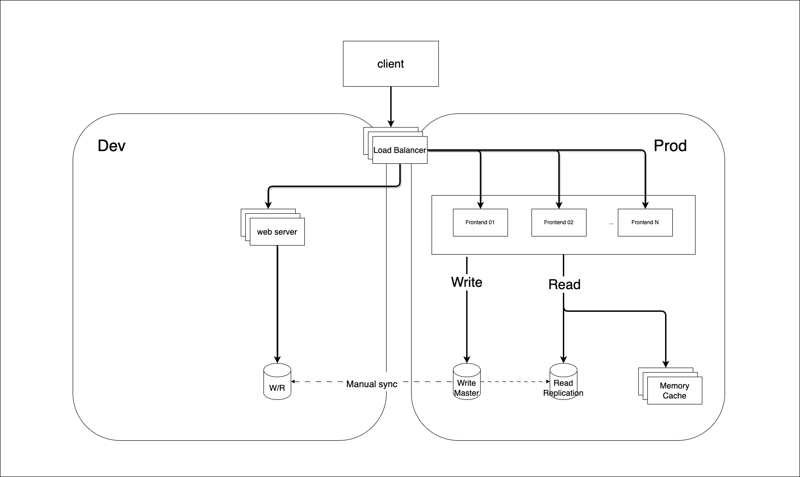

# Open Network Source-of-Truth Platform

ONSP(Open Network Source-of-Truth) is a scalable and high available network source-of-truth solution.

## Requirements
- Easy to scale when read/write request rate increase
- Easy to upgrade
- Easy to add new features tested from dev env
- Support dev and prod envs

### High level design
